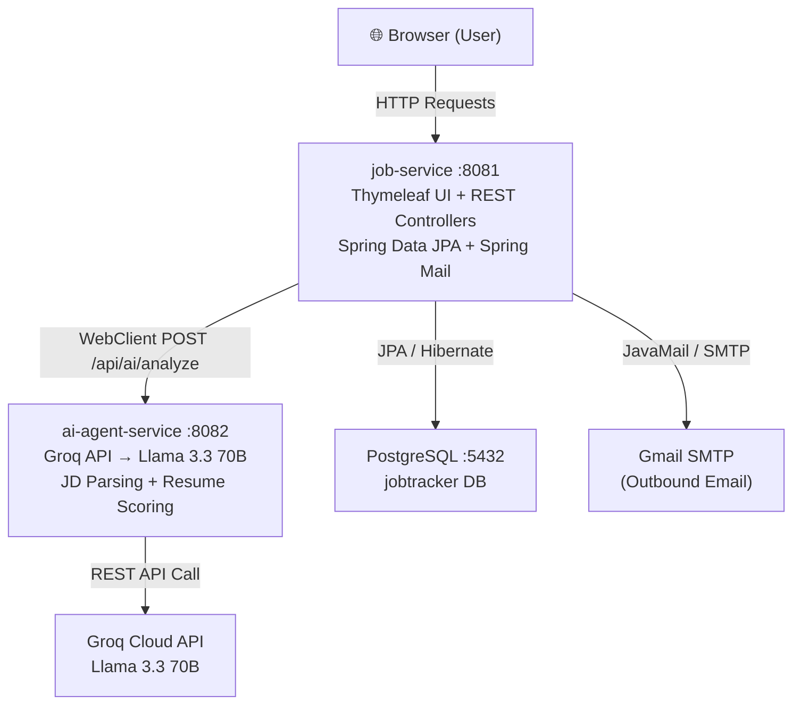
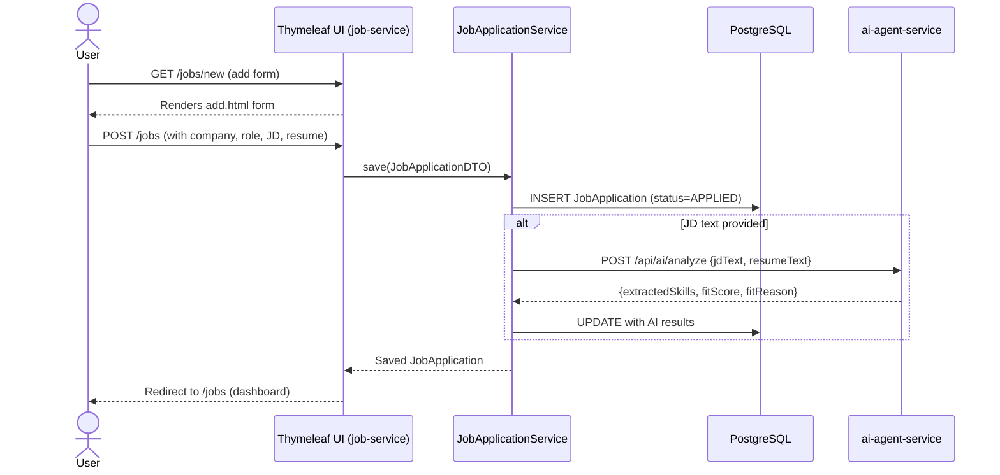
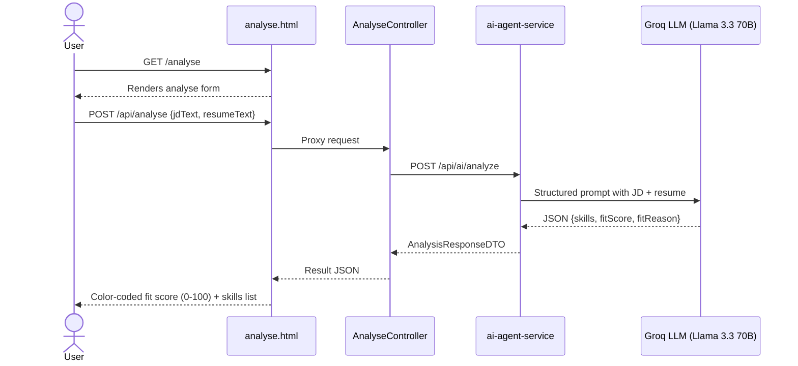
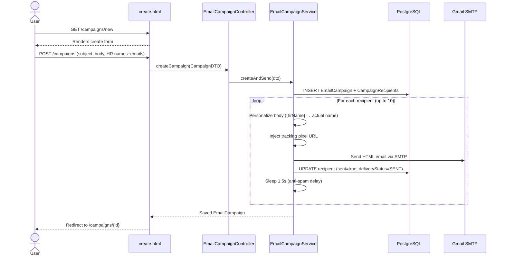
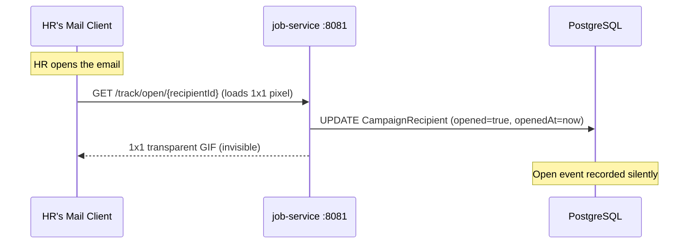
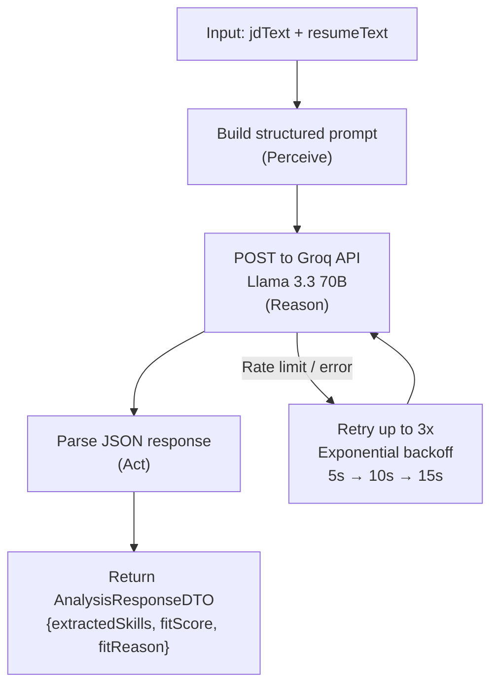
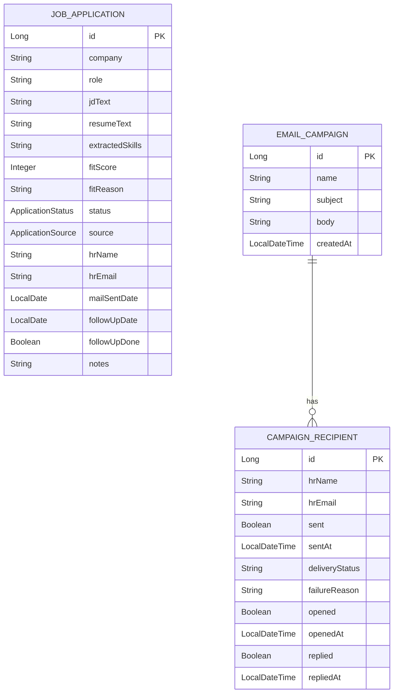
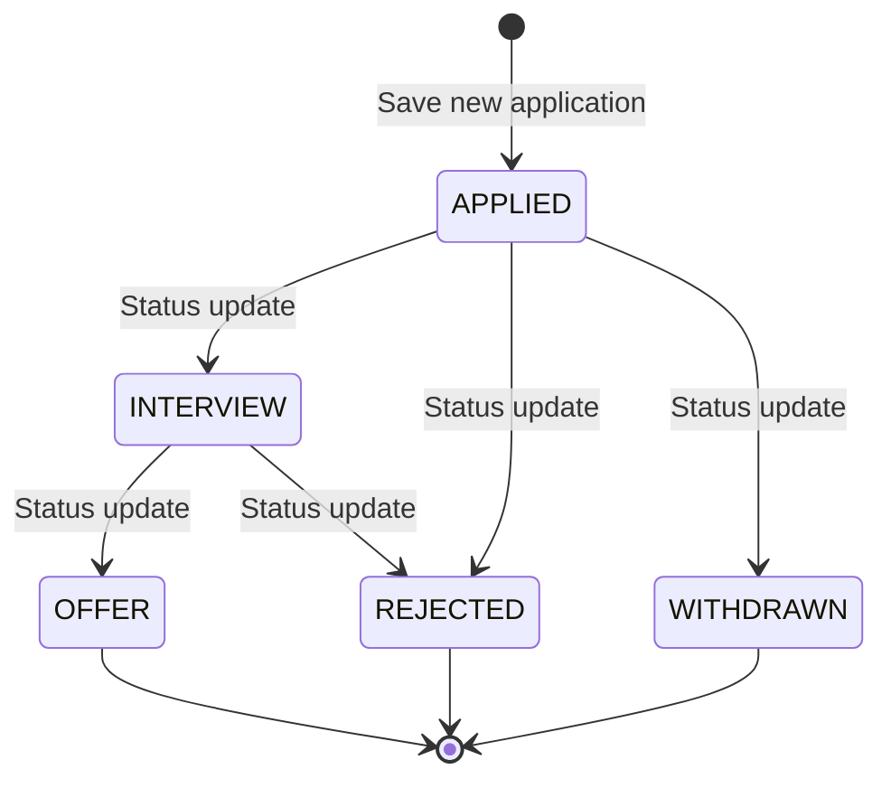

# 🧭 AI Job Tracker — Project Flow

## 🏗️ High-Level Architecture



---

## 📦 Microservices Overview

| Service | Port | Role |
|---|---|---|
| `job-service` | 8081 | Main app — UI, CRUD, email, tracking |
| `ai-agent-service` | 8082 | AI proxy — JD parsing & resume scoring |
| PostgreSQL | 5432 | Persistent storage |
| Redis | 6379 | Defined in Docker (future use) |

---

## 🔄 Core User Flows

### 1. 📊 Add a Job Application



---

### 2. 🔍 JD Analyser (Standalone AI Analysis)



---

### 3. 📧 Cold Mail Campaign Flow



---

### 4. 📬 Email Open Tracking Flow



---

## 🧠 AI Agent — Internal Flow



---

## 🗄️ Data Model



---

## 📡 REST API Surface

### job-service (`:8081`)

| Method | Endpoint | Handler | Description |
|---|---|---|---|
| `GET` | `/jobs` | `JobApplicationController` | Dashboard with stats |
| `GET` | `/jobs/new` | `JobApplicationController` | Add form |
| `POST` | `/jobs` | `JobApplicationController` | Save + trigger AI |
| `GET` | `/jobs/{id}` | `JobApplicationController` | Detail view |
| `POST` | `/jobs/{id}/status` | `JobApplicationController` | Update status |
| `POST` | `/jobs/{id}/followup` | `JobApplicationController` | Mark follow-up done |
| `POST` | `/jobs/{id}/delete` | `JobApplicationController` | Delete |
| `GET` | `/analyse` | `AnalyseController` | JD Analyser page |
| `POST` | `/api/analyse` | `AnalyseController` | AI proxy endpoint |
| `GET` | `/campaigns` | `EmailCampaignController` | Campaign list |
| `GET` | `/campaigns/new` | `EmailCampaignController` | Create form |
| `POST` | `/campaigns` | `EmailCampaignController` | Create + send |
| `GET` | `/campaigns/{id}` | `EmailCampaignController` | Campaign tracking |
| `POST` | `/campaigns/recipients/{id}/replied` | `EmailCampaignController` | Mark replied |
| `GET` | `/track/open/{id}` | `EmailCampaignController` | Open-tracking pixel |

### ai-agent-service (`:8082`)

| Method | Endpoint | Description |
|---|---|---|
| `POST` | `/api/ai/analyze` | Parse JD + score resume |
| `GET` | `/api/ai/health` | Health check |

---

## 🔁 Status Lifecycle



---

## 🐳 Docker Compose Topology

```
docker-compose up
│
├── postgres (port 5432)        ← job-service depends on this
├── redis (port 6379)           ← provisioned, future use
├── ai-agent-service (port 8082) ← needs GEMINI_API_KEY env var
└── job-service (port 8081)     ← depends on postgres + ai-agent-service
        │
        └── connects to postgres via JDBC
        └── connects to ai-agent-service via WebClient
```
